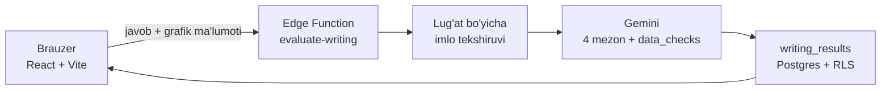

<div align="center">

# Take IELTS

**IELTS Writing javoblarini AI bilan baholaydigan mashq platformasi**

Writing Task 1 va Task 2 · AI baholash · natijalar tahlili

[**Saytni ochish →**](https://take-ielts.vercel.app)

<p>
  
  
  
  
  
</p>

</div>

---

## Loyiha haqida

Take IELTS — o'zbek tilidagi interfeys bilan ishlaydigan IELTS Writing mashq
platformasi. Task 1 va Task 2 javoblari imtihon vaqti bilan yoziladi, AI esa
to'rtta rasmiy mezon bo'yicha band qo'yib, xatolarni matn ichida ko'rsatadi.
Har bir urinish saqlanadi — bir mavzuni qayta yozib, o'sishni ko'rish mumkin.

## Qanday ishlaydi



## Imkoniyatlar

| Bo'lim | Nima bor |
|---|---|
| **Task 1** | 5 ta to'plam (bar, line, pie, jadval) · 20 daqiqa · kamida 150 so'z · grafik ma'lumotdan chiziladi |
| **Task 2** | 15 ta mavzu · 40 daqiqa · kamida 250 so'z |
| **AI baholash** | To'rtta rasmiy mezon, har biri uchun izoh va iqtibos · xatolar matn ichida belgilanadi |
| **Hisobotlar** | Task 1 va Task 2 alohida tablarda, band dinamikasi va o'rtacha ko'rsatkichlar |
| **Profil** | Supabase auth (email/parol va Google), javoblar tarixi |

### Writing AI baholash qanday ishlaydi

Insho Supabase Edge Function orqali Gemini modeliga yuboriladi va IELTS'ning
to'rtta rasmiy mezoni bo'yicha baholanadi:

- **Task Response / Task Achievement** — savolga qanchalik to'liq javob berilgan (Task 1'da: overview va raqamlar aniqligi)
- **Coherence & Cohesion** — tuzilma va bog'lovchi vositalar
- **Lexical Resource** — so'z boyligi
- **Grammatical Range & Accuracy** — grammatika

Javobda insho ustiga qo'yilgan izohlar (annotated essay), har bir mezon uchun
izohli fikr va yarim ball ko'tarish uchun aniq maslahat qaytadi.

> API kalit hech qachon brauzerga tushmaydi — u faqat Edge Function muhitida
> turadi. Sababi va tafsilotlari: [`supabase/WRITING-SETUP.md`](supabase/WRITING-SETUP.md).

## Nega bunday qilingan

Loyihadagi asosiy qarorlar va ularning sababi:

| Qaror | Sabab |
|---|---|
| **Task 1 grafigi rasm emas, ma'lumot** | Grafik `chart` obyektidan SVG bo'lib chiziladi va aynan o'sha raqamlar AI'ga matn ko'rinishida boradi. Bitta manba bo'lgani uchun "raqam noto'g'ri keltirilgan" degan izohni tekshirib bo'ladi — rasm bilan buni kafolatlab bo'lmasdi. |
| **Tayanch faktlar kodda hisoblanadi** | Eng katta/kichik qiymat, guruhlardagi tartib va qatorlar kesishgan joy kod bilan topilib, promptga qo'shiladi. Model bir marta "18 — eng yuqori qiymat" degan xatoni o'tkazib yuborgandi (aslida 19); endi u hisob-kitobga tayanmaydi. |
| **Imloni model emas, lug'at tekshiradi** | Til modeli matnni harflar emas, tokenlar sifatida ko'radi va "goverment" ni sezmay o'tib ketadi. Shuning uchun ~275k so'zlik lug'at va tahrir masofasi ishlatiladi. |
| **Baholash faqat serverda** | Gemini kaliti brauzerga umuman tushmaydi. `writing_results` ga yozishni faqat Edge Function bajaradi — RLS'da INSERT policy'si ataylab yo'q, shuning uchun foydalanuvchi o'ziga band score yozib qo'ya olmaydi. |
| **Aloqa uzilsa, "natija yo'q" deyilmaydi** | Bulut javob bermasa interfeys buni ochiq aytadi va qayta urinish tugmasini beradi. Aks holda bo'sh ro'yxat "ma'lumotlarim o'chibdi" degan taassurot qoldiradi. |

## Texnologiyalar

- **Frontend** — React 18, Vite 6, Tailwind CSS, React Router, Framer Motion
- **Backend** — Supabase (Postgres, Auth, Row Level Security, Edge Functions)
- **AI** — Google Gemini (server tomonida, Edge Function ichida)
- **Deploy** — Vercel

## Ishga tushirish

```bash
git clone https://github.com/mahmudulashev/Take-IELTS.git
cd Take-IELTS
npm --prefix app install
```

Supabase ma'lumotlarini kiriting:

```bash
cp app/.env.example app/.env
```

`app/.env` ichiga o'z loyihangiz qiymatlarini yozing:

```env
VITE_SUPABASE_URL=https://your-project-ref.supabase.co
VITE_SUPABASE_ANON_KEY=your-anon-key
```

Keyin dev serverni oching:

```bash
npm run dev
```

### Bazani tayyorlash

Supabase Dashboard → SQL Editor'da quyidagilarni ishga tushiring:

| Fayl | Nima qiladi |
|---|---|
| [`supabase/rls-setup.sql`](supabase/rls-setup.sql) | Jadvallar va RLS policy'lari — har kim faqat o'z natijasini ko'radi |
| [`supabase/writing-setup.sql`](supabase/writing-setup.sql) | `writing_results` jadvali va unga tegishli policy'lar |

Writing bo'limini to'liq yoqish uchun (Gemini kaliti, funksiyani deploy qilish)
[`supabase/WRITING-SETUP.md`](supabase/WRITING-SETUP.md) dagi uch qadamni bajaring.

## Buyruqlar

| Buyruq | Nima qiladi |
|---|---|
| `npm run dev` | Dev server (Vite) |
| `npm run build` | Production build |
| `npm run preview` | Build'ni lokalda ko'rish |

## Tuzilma

```
.
├── app/                      # React ilova (Vite)
│   ├── src/
│   │   ├── pages/            # Landing, Auth, Dashboard, Writing, Reports, Profile
│   │   ├── components/       # Layout, Task 1 grafigi, writing natija komponentlari
│   │   ├── data/             # Task 1 grafiklari va Task 2 mavzulari
│   │   ├── lib/              # Supabase klient, writing mantiqi, grafik yordamchilari
│   │   └── context/          # Auth konteksti
│   └── public/               # Favicon, manifest, sitemap
└── supabase/
    ├── functions/            # evaluate-writing Edge Function
    └── *.sql                 # Jadvallar va RLS sozlamalari
```

## Hujjatlar

| Fayl | Mavzu |
|---|---|
| [`DEPLOY-NOTES.md`](DEPLOY-NOTES.md) | Vercel sozlamalari va nega aynan shunday |
| [`GRADER-NOTES.md`](GRADER-NOTES.md) | Writing baholash tarixi, kalibratsiya, prompt qoidalari |
| [`supabase/WRITING-SETUP.md`](supabase/WRITING-SETUP.md) | AI baholashni noldan ishga tushirish |

## Deploy

Vercel'da Root Directory sozlamasiga qarab ikkita `vercel.json` dan biri o'qiladi
(ildizdagi yoki `app/` ichidagi). **Ikkalasini bir xil holatda saqlang** — birini
o'zgartirsangiz, ikkinchisini ham yangilang. Batafsil: [`DEPLOY-NOTES.md`](DEPLOY-NOTES.md).

---

<div align="center">
<sub>Muallif: <a href="https://github.com/mahmudulashev">Mahmud Ulashev</a></sub>
</div>
